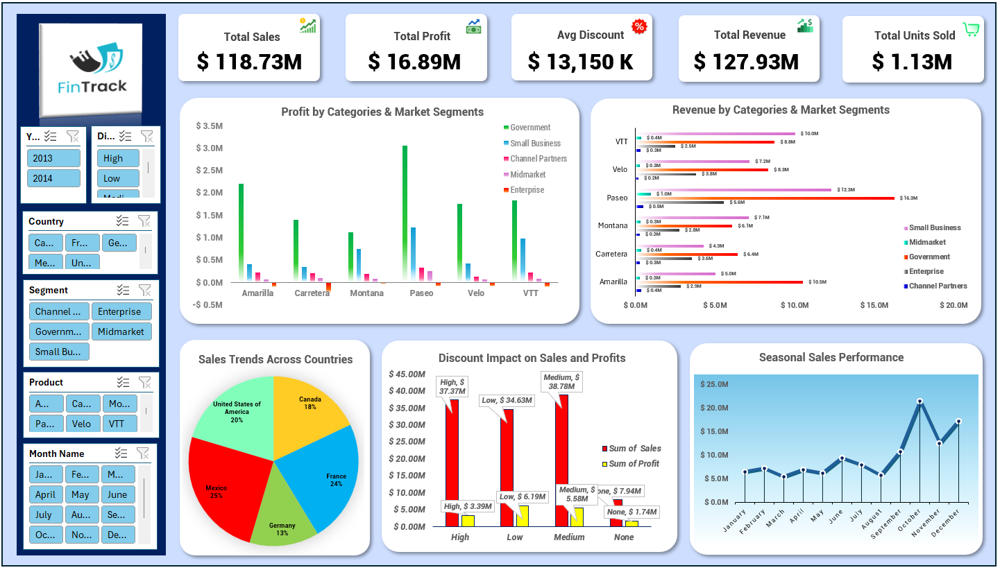
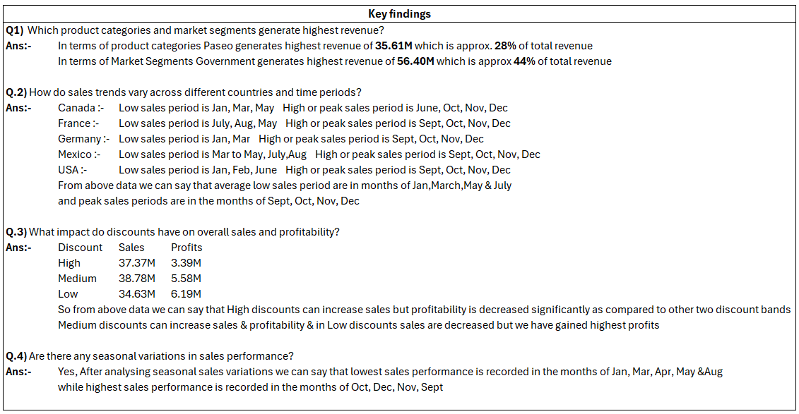

## Excel-Fintrack-Business-Analytics-Dashboard

### Table of Contents

- [Project Overview](#project-overview)
- [Problem Statement](#problem-statement)
- [Dataset](#dataset)
- [Tools & Technologies](#tools--technologies)
- [Data Cleaning & Preparation](#data-cleaning--preparation)
- [Dashboard KPIs](#dashboard-kpis)
- [Key Findings](#key-findings)
- [Dashboard](#dashboard)
- [Business Insights](#business-insights)
- [Project Structure](#project-structure)
- [Author](#author)
- [Project Status](#project-status)
---

### Project Overview

FinTrack Sales Analytics Dashboard is an Excel-based business intelligence project designed to analyze sales, revenue, profit, discounts, products, market segments, countries, and seasonal sales performance.
The project transforms sales data into an interactive dashboard to identify important business trends, performance drivers, and opportunities for improving profitability.

---

### Problem Statement

Businesses need to understand how products, market segments, countries, discounts, and seasonal periods affect sales and profitability.
The objective of this project is to analyze historical sales data and identify:
- Highest-performing products
- Highest-revenue market segments
- Country-wise sales trends
- Monthly and seasonal sales patterns
- Impact of discounts on sales and profit
- Opportunities for improving profitability
---

### Dataset

The dataset contains sales-related information including:
- Year
- Country
- Product
- Product Category
- Market Segment
- Month
- Sales
- Revenue
- Profit
- Discount
- Units Sold

### Countries

- Canada
- France
- Germany
- Mexico
- United States

### Market Segments

- Government
- Small Business
- Channel Partners
- Midmarket
- Enterprise
---

### Tools & Technologies

- Microsoft Excel
- Pivot Tables
- Excel Charts
- Excel Slicers
- Data Cleaning
- Data Visualization
---

### Data Cleaning & Preparation

The data preparation process involved reviewing and preparing the sales data for analysis and dashboard creation.
Key preparation activities included:
1. Checking for duplicate records
2. Checking for missing values
3. Standardizing categorical fields
4. Formatting numerical fields
5. Building Pivot Tables
6. Creating KPIs and visualizations
---

### Dashboard KPIs

| KPI | Value |
|---|---:|
| Total Sales | $118.73M |
| Total Profit | $16.89M |
| Total Revenue | $127.93M |
| Total Units Sold | 1.13M |

---

### Key Findings

### Product Performance
**Paseo** generated the highest revenue among the products, at approximately **$35.61M**, representing around **28% of total revenue**.

### Market Segment Performance
The **Government** market segment generated the highest revenue, at approximately **$56.40M**, representing around **44% of total revenue**.

### Country Performance
The dashboard compares sales performance across:
- Canada
- France
- Germany
- Mexico
- United States
The country analysis helps identify differences in sales contribution and performance.

### Discount Analysis
The dashboard compares sales and profit across three discount levels:

| Discount Level | Sales | Profit |
|---|---:|---:|
| High | $37.37M | $3.39M |
| Medium | $38.78M | $5.58M |
| Low | $34.63M | $6.19M |
The analysis indicates that higher discounts can support sales but may significantly reduce profitability.
Low discounts generated lower sales than medium and high discounts but produced the highest profit among the three discount levels.

### Seasonal Trends
Sales performance was stronger during **September, October, November, and December**, while several months earlier in the year showed comparatively lower sales performance.

---

### Dashboard

---

### Key Findings

---

### Business Insights
The dashboard can help management:
- Identify high-revenue products
- Focus on profitable market segments
- Understand country-level performance
- Identify seasonal demand patterns
- Evaluate discount strategies
- Balance sales growth with profitability
- Improve sales and profitability planning
---

### Project Structure
<pre> Excel-Fintrack-Business-Analytics-Dashboard/ ├── README.md ├── data/ │ └── fintracksalesdata.xlsx ├── dashboard/ │ └── FinTrackSalesDashboard.xlsx ├── images/ │ ├── dashboard.png │ └── key-findings.png └── documentation/ └── project-summary.md </pre>
    
### Author
***Imran Modi***

### Project Status
**Completed — Excel Sales Analytics Dashboard**
